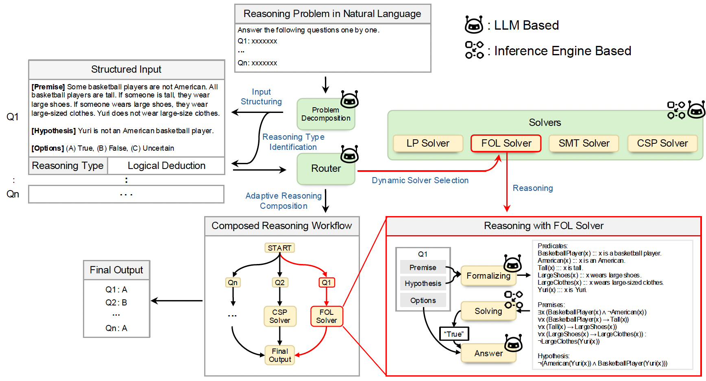

# Adaptive LLM-Symbolic Reasoning via Dynamic Logical Solver Composition

**arXiv Paper**: https://arxiv.org/pdf/2510.06774

## 🧾 Abstract

> Neuro-symbolic NLP methods aim to leverage the complementary strengths of large language models and formal logical solvers. However, current approaches are mostly static in nature, i.e., the integration of a target solver is predetermined at design time, hindering the ability to employ diverse formal inference strategies. To address this, we introduce an adaptive, multi-paradigm, neuro-symbolic inference framework that: (1) automatically identifies formal reasoning strategies from problems expressed in natural language; and (2) dynamically selects and applies specialized formal logical solvers via autoformalization interfaces. Extensive experiments on individual and multi-paradigm reasoning tasks support the following conclusions: LLMs are effective at predicting the necessary formal reasoning strategies with an accuracy above 90 percent. This enables flexible integration with formal logical solvers, resulting in our framework outperforming competing baselines by 27 percent and 6 percent compared to GPT-4o and DeepSeek-V3.1, respectively. Moreover, adaptive reasoning can even positively impact pure LLM methods, yielding gains of 10, 5, and 6 percent on zero-shot, CoT, and symbolic CoT settings with GPT-4o. Finally, although smaller models struggle with adaptive neuro-symbolic reasoning, post-training offers a viable path to improvement. Overall, this work establishes the foundations for adaptive LLM-symbolic reasoning, offering a path forward for unifying material and formal inferences on heterogeneous reasoning challenges.



## Demonstrations

We provide two demonstrations to show the applicability of our framework in both single-question and sequential testing scenarios:
- Single-question testing: [link](./demo_single_question.ipynb)
- Sequential testing: [link](./demo_sequential_question.ipynb)

## 🛠️ System Requirements

**Installation**:
```bash
# Create test env
conda create -n test python=3.11
conda activate test
# Install Python dependencies
pip install -r requirements.txt
```

## 🔧 Solvers Setup

### Prover9 Installation
For Prover9, we use the implementation from NLTK. For installation instructions, please refer to: https://www.nltk.org/howto/inference.html#prover9-installation

### PyKE Knowledge Engine
The PyKE rule-based reasoning engine is included in `libs/pyke-1.1.1/`. Install it by:
```bash
cd libs/pyke-1.1.1
python setup.py build
python setup.py install
```

### Z3 Solver
Z3 is automatically installed via pip requirements. Ensure system compatibility for optimal performance.


### MiniZinc Setup
1. Download MiniZinc from the official website
2. Install following the platform-specific instructions
3. Configure the MiniZinc path in `config.yaml` under `agent_config_dsw.minizinc_path`

## 📒 Data Preparation
The data we use comes from external benchmarks. You just do some post-processing to make it work with your system.

Specifically, you can obtain the data we use through the following steps:

1. Download the `FOLIO`, `LogicalDeduction`, `ProntoQA`, and `ProofWriter` datasets from https://github.com/teacherpeterpan/Logic-LLM/tree/main/data, and place them in folders under `./data`.
2. Download the `TREC` data from https://trec.nist.gov/data/trials/qrels2021.txt and https://trec.nist.gov/data/trials/topics2021.xml respectively, and place them in `./data/TREC`.
3. Run `python -m create_trec_dataset` to process the TREC data.
4. Run `python -m create_mixing_data` to create the mixed data.
5. Run `python -m create_sequential_dataset` to create the sequential dataset.

## ⚙️ Configuration Setup

Before running the system, you need to configure the environment paths and API keys in `config.yaml`:

### 1. Environment Paths Configuration
Update the `agent_config_dsw` section with your local paths:
```yaml
agent_config:
  minizinc_path: "/path/to/your/MiniZincIDE"
```

### 2. API Keys Configuration
Configure your API keys in the `api_config` section. The framework supports both OpenAI API and Azure OpenAI API. Hugging Face API keys are required for downloading and using models from the Hugging Face Hub.

**For API Callings**:
```yaml
api_config:
  gpt-4o-azure:
    model_name: "YOUR_AZURE_MODEL_NAME"
    azure_endpoint: "YOUR_AZURE_ENDPOINT"
    openai_api_version: "YOUR_API_VERSION"
    api_key: "YOUR_AZURE_API_KEY"

  gemini:
    api_key: "YOUR_GEMINI_API_KEY"
```

**For Hugging Face Models**:
```yaml
  your-model-name:
    model_name: "/path/to/your/huggingface/model"
    api_key: "YOUR_HUGGINGFACE_API_KEY_HERE"
    lora_path: "/path/to/lora/checkpoint"  # Optional for fine-tuned models
```


## 🧪 Testing

To run evaluations, execute:
```bash
bash test_scripts.sh
```

This will run tests on both local models and API-based models using the mixed dataset configuration.

## 📄 License

Our framework is released under the GNU General Public License v3.0. The complete license text is provided in `LICENSE`.

## 📚 Citation

If you use the framework in academic work, please cite the accompanying paper:

```
@article{xu2025adaptive,
  title   = {Adaptive LLM-Symbolic Reasoning via Dynamic Logical Solver Composition},
  author  = {Lei Xu and Pierre Beckmann and Marco Valentino and André Freitas},
  year    = {2025},
  journal = {arXiv preprint arXiv: 2510.06774}
}
```

## 🙏 Acknowledgments

This work was partially funded by the Swiss National Science Foundation (SNSF) projects RATIONAL and M-RATIONAL.
